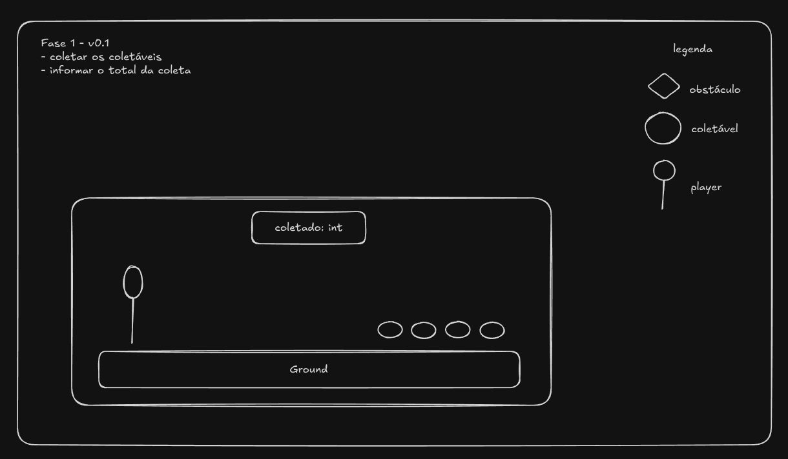

# Proof of Concept - Iago

## Requisitos

- Unity Hub
- Unity `6.3 TLS`
- .NET SDK `10.0.105 LTS`

## Assets

- Simple 2D Platformer BE2

## Unity Packages

- 2D Universal - Core Package
- Unity Input System

## Como rodar

```sh
# Clone o repositório:
git clone https://github.com/ludiverso/Project-Monsters.git

# Acesse o diretorio do projeto:
cd Project-Monsters

# Rode os comandos necessários:
dotnet tool restore && dotnet husky install

# Acesse a branch
git checkout poc-iago
```

## Versões

Critérios de Aceite da Versão 0.1:

- [x] Sistema de Movimentação Simples (Esquerda e Direita) com suporte ao **Teclado** aplicada ao **Player**
- [x] Física e Sistema de Colisão aplicada ao **Player**, **Ground**
- [x] Sistema de Colisão e Coleta aplicada ao **Colectable**
- [ ] Renderizar o total de coletáveis coletados pelo **Player**


